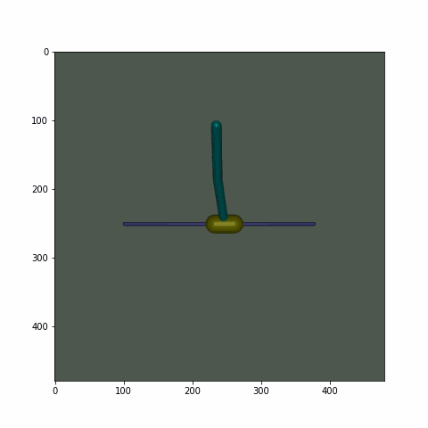
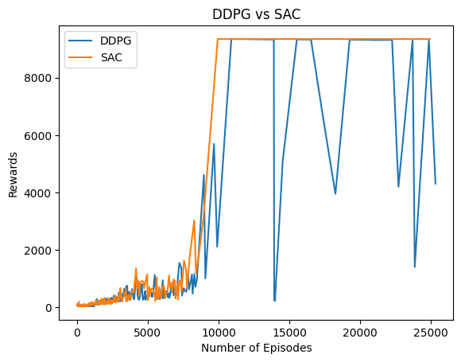
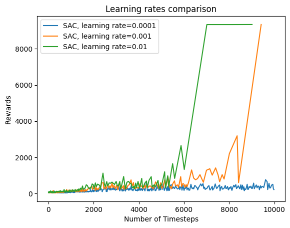

## Эксперименты с различными стратегиями модели, исследование влияние learning rate на сходимость алгоритма Q-learning

## Ефаринов Павел Андреевич

Для выполнения работы была выбрана среда [Inverted Double Pendulum](https://gymnasium.farama.org/environments/mujoco/inverted_double_pendulum)

#### Описание среды

##### Action space

Box из одного значения - силы, примененной к каретке в основании маятника (от -1 до 1)

##### Observation space

10-и мерный вектор

Координаты каретки, скорость, углы узлов маятника

#### Сравнение моделей DDPG и SAC

Для обучения были выбраны параметры `timestamp=25000`.

##### DDPG

Был запущен с параметрами шума `NormalActionNoise(mean=np.zeros(n_actions), sigma=0.1 * np.ones(n_actions))`

##### SAC

Модель не предусматривает дополнительной конфигурации и была запущена с значениями по-умолчанию. Длительность обучения также 25000 степов

##### Сравнение скорости обучения

При обучении велась запись награды, которую зарабатывала модель за каждый эпизод

На первой картинке видны все **25000** степов обучения 

На второй картинке показаны только первые **3000**

Видно, что из-за вносимого шума обучение DDPG занимает чуть большее время (особенно заметно с 0 до 1300 степов). При нахождении оптимальной стратегии SAC придерживается ее, а DDPG может делать серьезные “ошибки” 

Влияние learning rate на сходимость при обучении

При оценке влияния learning rate на скорость обучения и сходимости были перебраны значения 0.01, 0.001, 0.0001 для модели SAC

По графику видно, что для learning rate 0.01 cходимость достигается быстрее всего. Проблем со сходимостью на больших lr не наблюдается.

При малом learning rate модель не успевает обучиться, также не наблюдается значимого прогресса.

