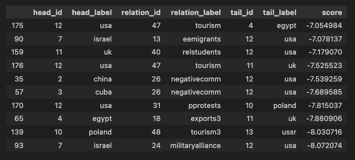
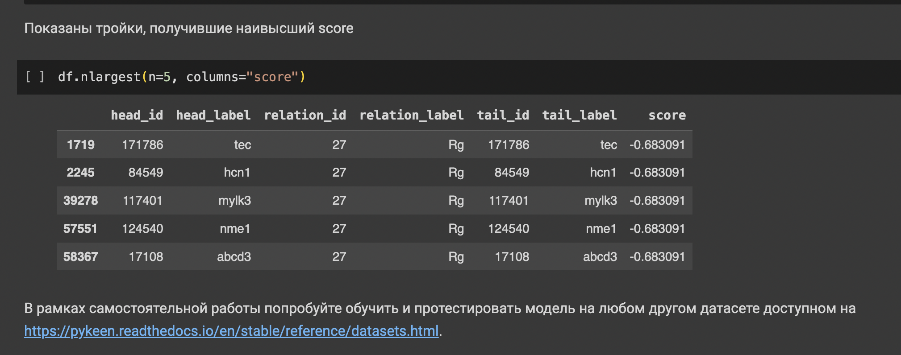

# Лабораторная работа 4

Выполнили:
* Герасимчук Михаил (P4241)
* Проскурин Глеб (P4241)

# Описание
В рамках данной лабораторной работы мы самостоятельно обучим и протестируем модель. В качестве датасета было решено использовать `Nations`. В нём показаны в каких отношениях находятся страны.

# Графовые нейронные сети (GNNs)
Графовые нейронные сети представляют собой класс нейронных сетей, специально разработанный для работы с графовыми структурами данных. Они могут моделировать зависимости и взаимодействия между сущностями в графе, позволяя учитывать контекст и структуру данных при выполнении задач.

# Graph embedding
Эмбеддинги в контексте графовых нейронных сетей представляют собой векторные представления вершин графа. Они извлекаются из GNN и представляют сущности в пространстве низкой размерности. Эти векторы обладают свойством сохранять структурную информацию о графе и могут использоваться для различных задач, таких как предсказание отношений или классификация вершин.

# Датасет Pharm
`PharmKG` — это многореляционный атрибутивный граф биомедицинских знаний, состоящий из более чем 500 тысяч отдельных взаимосвязей между генами, лекарствами и заболеваниями, с 29 типами отношений в словаре, насчитывающем около 8000 однозначных сущностей.

В датасете были ссыкли графа на самого себя с отношением 27(скорее всего, что они замыкаются статус), от чего лучше результаты показали именно они. 

## Выводы
В данной лаборатоной работе мы освоили обучение и тестирование графовых нейронных сетей для анализа зависимостей в данных.

