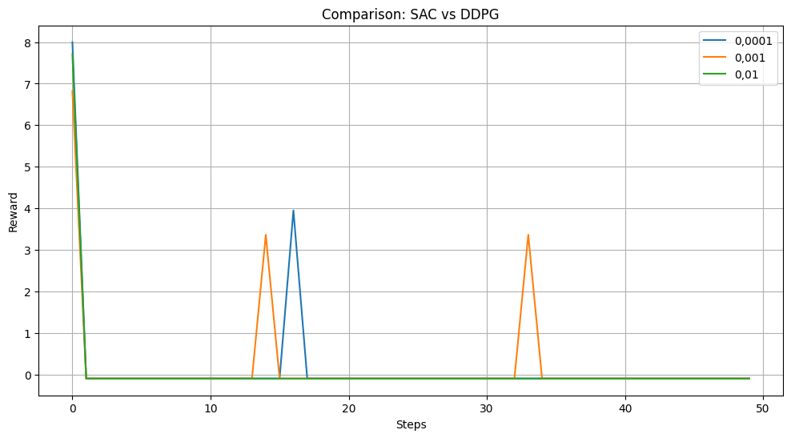

# Лабораторная работа №2

---
Выполнил Филиппенко Илья

## Описание окружения Car Racing.

Для данной лабораторной работы требовалось использование окружения, использующего Box в качестве пространства действий.
Присутствует 3 уровня сложности.

## Obseravation space 

Пространство наблюдений представляет из себя гоночную трассу в виде массива RGB пикселей

## Action space

Пространство действий представляет из себя наборы входов для управления машиной - газ, тормоз, поворот и тд.

## Ход работы

Код доступен [по ссылке](RL-lab2.ipynb)

Награды для различных стратегий

 

Сравнение различных Learning rate

 

---
## Вывод
Несмотря на то, что нам не удалось добиться сходимости, мы можем сделать следующие выводы:
#### Маленький learning rate:

Обучение будет медленным, так как обновления весов модели будут небольшими.
Может потребоваться больше времени для достижения сходимости.
Существует риск застревания в локальных минимумах.

#### Средний learning rate:

Может оказаться хорошим компромиссом между скоростью обучения и стабильностью.
Быстрее, чем маленький learning_rate, но может все еще требовать достаточно большое количество времени для сходимости. Требует аккуратного подбора значения.

#### Большой learning rate:
Обучение в среднем будет быстрее, так как веса модели обновляются с большими шагами.
Может привести к нестабильному обучению, особенно если learning rate слишком велик.
Существует риск "перепрыгивания" оптимальных значений, что может замедлить или прервать сходимость.

Эвристики, которые были вскольз упомянуты на первом курсе - значения LR в диапазоне [0.002, 0.005] - оказались оптимальными.

В данной лабораторной работе мы исследовали различные стратегии и влияние learning_rate на процесс обучения агента. Эксперименты позволяют нам понять, что различные стратегии и параметры лучше подходят для разных задач.

Разница в наградах в ходе обучения между epsilon-greedy стратегией и softmax минимальна. Единственное отличие - softmax имеет большую дисперсию, что свидетельствует о большем приоритете в исследовании.